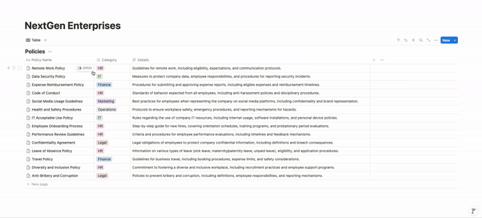
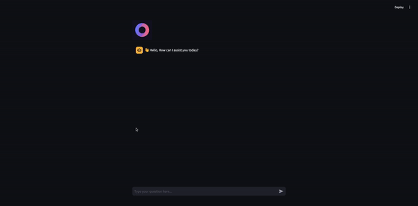

# Notion-Chroma-Chatbot

A **Streamlit** chatbot application that integrates **Notion**, **ChromaDB**, and **LangChain**. The chatbot leverages pre-trained embedding models to enable users to query information efficiently from Notion databases.





## Features

- **Document Parsing**: Load and process documents directly from Notion using `NotionDBLoader`.
- **Chunking**: Split large documents into manageable chunks for efficient retrieval.
- **Chroma Vector Store**: Store embeddings and metadata in ChromaDB for similarity search.
- **Streamlit Frontend**: An interactive web-based interface for chatting with the chatbot.
- **Open Source Models**: Uses the lightweight `all-MiniLM-L6-v2` embedding model for fast and accurate results.

---

## Installation

### 1. Clone the Repository
```bash
git clone https://github.com/jabahm/notion-chroma-chatbot.git
cd notion-chroma-chatbot
```

### 2. Create a Virtual Environment
```bash
python3 -m venv venv
source venv/bin/activate  # For Windows: venv\Scripts\activate
```

### 3. Install Dependencies
```bash
pip install -r requirements.txt
```

---

## Usage

### 1. Configure Environment Variables
Create a .env file in the project root with the following variables:
```makefile
NOTION_INTEGRATION_TOKEN=<Your Notion Integration Token>
NOTION_DATABASE_ID=<Your Notion Database ID>
```

### 2. Load Data from Notion to Chroma
Run the notion_to_chroma.ipynb notebook or convert it to a Python script. This will:
- Load documents from your Notion database.
- Chunk the documents into smaller pieces.
-Generate embeddings and save them to ChromaDB.

### 3. Start the Streamlit Chatbot
```bash
streamlit run app.py
```

---

## Using Docker
You can containerize the application using the provided Dockerfile.

### 1. Build the Docker Image
```bash
docker build -t notion-chroma-chatbot
```
### 2. Run the Docker Container
```bash
docker run -p 8501:8501 --env-file .env notion-chroma-chatbot
```
The chatbot will be accessible at http://localhost:8501.


